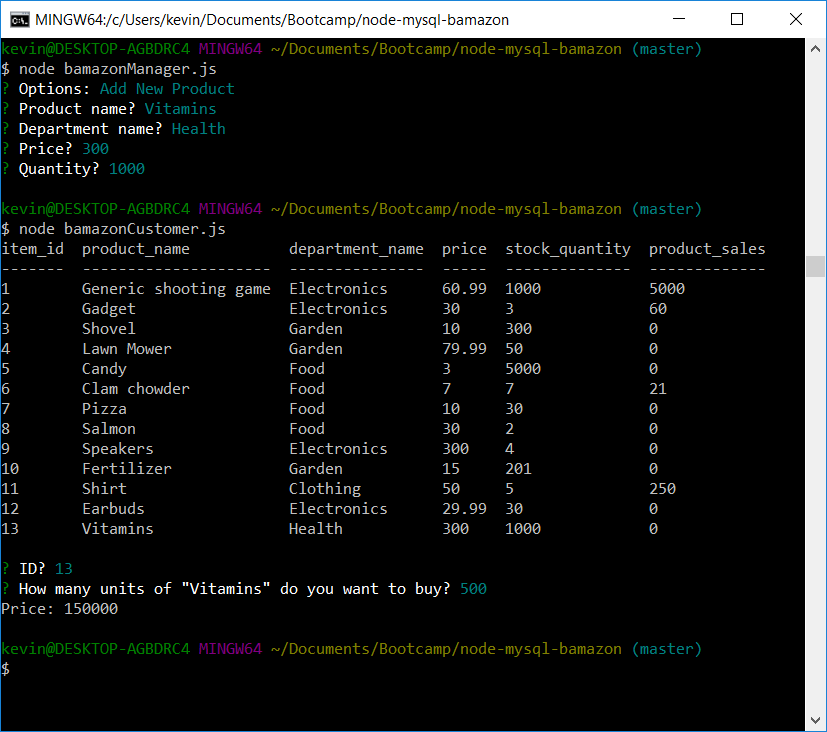

# node-mysql-bamazon

## Overview
App simulates an online store, backed by a mysql database. There are three different node apps, one for customers, one for managers, and one for supervisors

### Customer
Called with `node bamazonCustomer.js`. Shows all available products, and then asks what, and how much the customer wants to buy.


Total price is shown to the customer, and the database is updated. Quantity is decreased by how many units the customer purchased, and product_sales is increased by total price of order.


Attempting to purchase more units than are in stock results is not allowed.

### Manager
Called with `node bamazonManager.js`. Manager is presented with four options.


Show products with how much is in stock


Show products with < 5 units in stock


Manager can also choose to increase the stock of some product. Here, 200 units of fertilizer is added to the store.


A completely new product can also be added to the store. (Earbuds in this case.)

### Supervisor
Called with `node bamazonSupervisor.js`. Supervisor can see the profits of each department.


`product_sales` is calculated by summing all the sales for products of that department. This table is the result of the following SQL query:

```
SELECT department_id, departments.department_name, 
SUM(product_sales) AS product_sales, over_head_costs, 
SUM(product_sales) - over_head_costs AS total_profit
FROM products
RIGHT JOIN departments 
ON products.department_name=departments.department_name
GROUP BY departments.department_name
```

The supervisor can also add a new department.


Note that the new department has NULL for product_sales. This is because there is no such product in the store. Going back to `bamazonManager.js`, we can create a new product for that department.



Vitamins is now a new product. Using `bamazonCustomer.js` to buy vitamins will update product sales.


These sales are reflected in the supervisor view.

## Dependencies
Listed in `package.json`.
`inquirer` for getting user input
`console.table` for displaying tables
`mysql` for accessing database
`dotenv` to hide database password